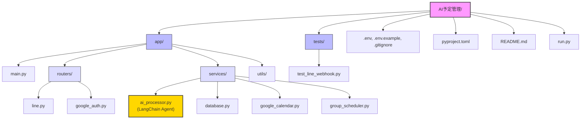
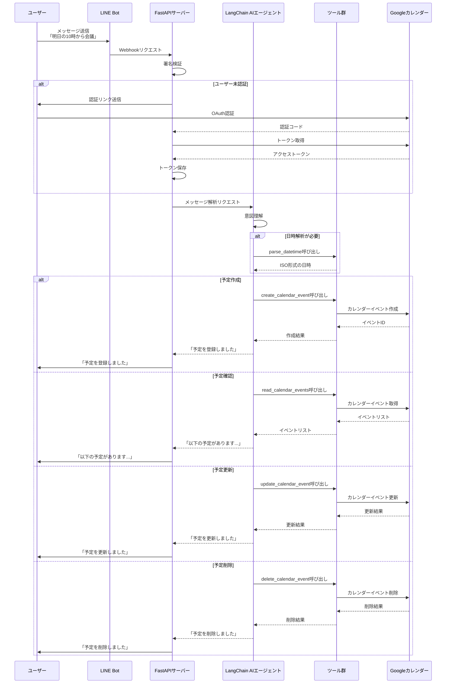
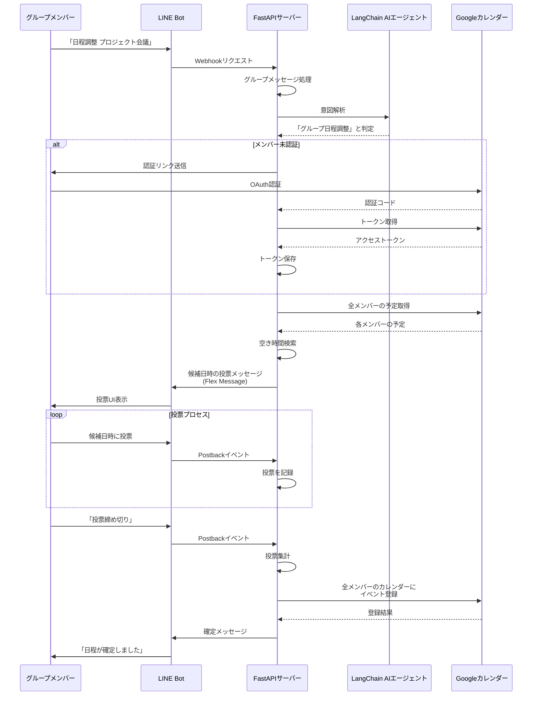
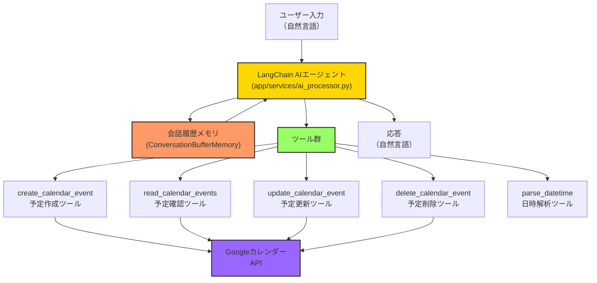

# AI予定管理アプリのファイル構造と処理フロー

## ファイル構造図

## 処理フロー図

### 1. 個人予定管理の処理フロー（LangChain AIエージェント使用）

### 2. グループ日程調整の処理フロー

### 3. LangChain AIエージェントのアーキテクチャ

## LangChain AIエージェントの説明

### 1. AIエージェントの概要

LangChainを使用したAIエージェントは、ユーザーの自然言語入力を理解し、適切なツールを選択・実行して予定管理タスクを完了させる中心的なコンポーネントです。このエージェントは以下の特徴を持ちます：

- **自然言語理解**: ユーザーの入力から意図（予定の作成/確認/更新/削除）を抽出
- **ツール選択**: 適切なツールを選んで実行する能力
- **会話履歴**: 過去のやり取りを記憶し、文脈を理解
- **構造化出力**: 自然言語入力から構造化データへの変換

### 2. 主要コンポーネント

1. **LLM (Large Language Model)**
   - Google Gemini Pro APIを使用
   - 自然言語理解と生成を担当

2. **ツール群**
   - `create_calendar_event`: 予定作成ツール
   - `read_calendar_events`: 予定確認ツール
   - `update_calendar_event`: 予定更新ツール
   - `delete_calendar_event`: 予定削除ツール
   - `parse_datetime`: 自然言語の日時表現をISO形式に変換するツール

3. **プロンプトテンプレート**
   - エージェントの役割と使用可能なツールを定義
   - 日本語での応答を指示

4. **会話メモリ**
   - `ConversationBufferMemory`を使用
   - 過去の会話履歴を保持し、文脈理解を可能に

### 3. 処理フロー

1. ユーザーがLINE Botにメッセージを送信
2. FastAPIサーバーがWebhookを受け取り、AIエージェントに処理を依頼
3. AIエージェントがメッセージを解析し、意図を理解
4. 必要に応じて日時解析ツールを使用
5. 意図に基づいて適切なカレンダーツールを選択・実行
6. 実行結果を自然言語で整形し、ユーザーに返信

### 4. 技術的詳細

- **AgentExecutor**: ツール選択と実行を管理
- **StructuredTool**: 型付きの関数をツールとして定義
- **ChatPromptTemplate**: エージェントの指示を定義
- **ConversationBufferMemory**: 会話履歴の管理

### 5. 利点

- **柔軟な自然言語理解**: 様々な表現方法に対応
- **文脈理解**: 会話の流れを理解し、適切に応答
- **拡張性**: 新しいツールの追加が容易
- **モジュール性**: 各コンポーネントが明確に分離され、保守性が高い

LangChainを使用したAIエージェントの導入により、ユーザーはより自然な会話形式でカレンダー操作が可能になり、アプリケーションの使いやすさと機能性が大幅に向上しました。
